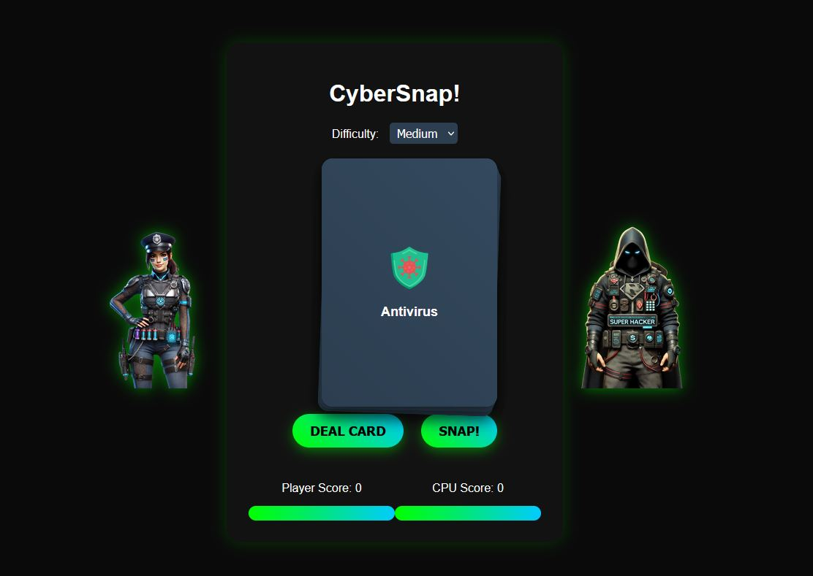

# CyberSnap!



CyberSnap! is a fast-paced cybersecurity-themed card game where players race against the hacker to defend the digital realm. Test your reflexes in this exciting web-based game!

## Description

Race against the hacker to defend the digital realm in this fast-paced cybersecurity snap card game!

CyberSnap! combines the classic "Snap!" card game mechanics with cybersecurity concepts, creating an engaging and educational experience. Players must quickly identify matching cybersecurity cards and snap them before the hacker does.

## Features

- Engaging cybersecurity-themed gameplay
- Three difficulty levels: Easy, Medium, and Hard
- Dynamic scoring system based on reaction time
- Responsive design for various screen sizes
- Educational content featuring key cybersecurity concepts

## Technologies Used

- HTML5
- CSS3
- JavaScript 

## Installation

1. Clone the repository:
   ```
   git clone https://github.com/dwain-barnes/CyberSnap.git
   ```
2. Navigate to the project directory:
   ```
   cd cybersnap
   ```
3. Open `index.html` in your web browser to start the game.

## How to Play

1. Select your difficulty level: Easy, Medium, or Hard.
2. Click the "Deal Card" button to reveal a new cybersecurity concept card.
3. If the new card matches the previous card, quickly click the "Snap!" button.
4. Score points for correct snaps, but be careful - incorrect snaps will give points to the CPU!
5. The game ends when all cards have been dealt. The player with the highest score wins!

## Customization

You can easily customize the game by modifying the `cyberConcepts.js` file to add or change the cybersecurity concepts used in the game.

## License

This project is licensed under the MIT License - see the [LICENSE.md](LICENSE.md) file for details.

## Acknowledgments

- Cybersecurity icons created by icons8 from icons8.com
---

Enjoy playing CyberSnap! and learning about cybersecurity concepts in a fun, interactive way!
